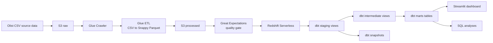
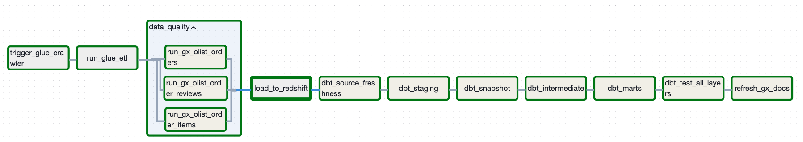
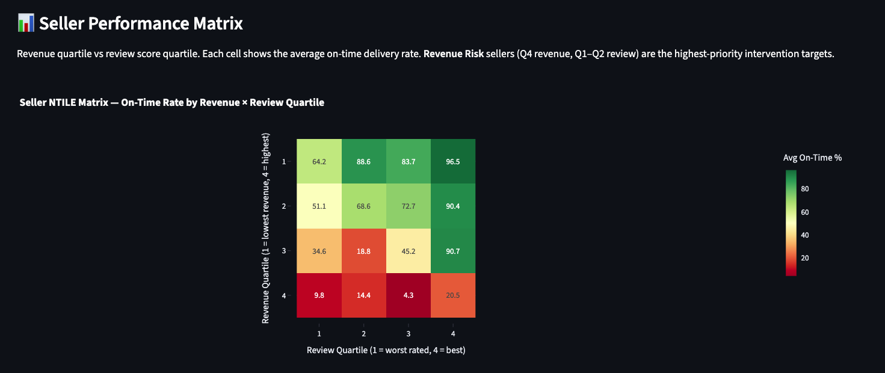
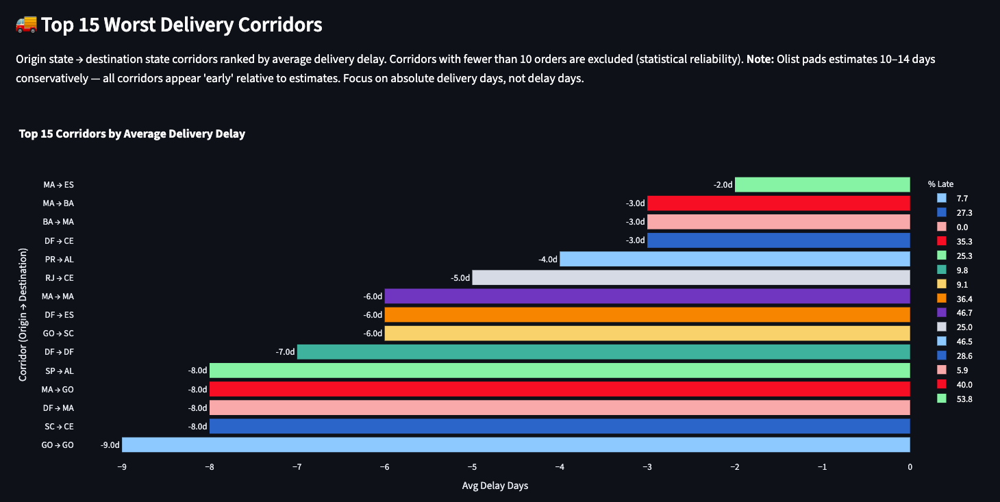
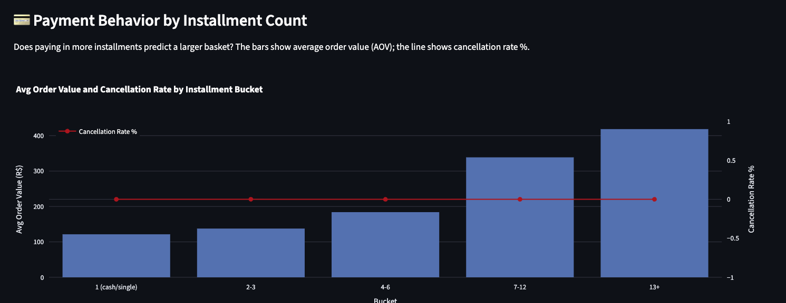
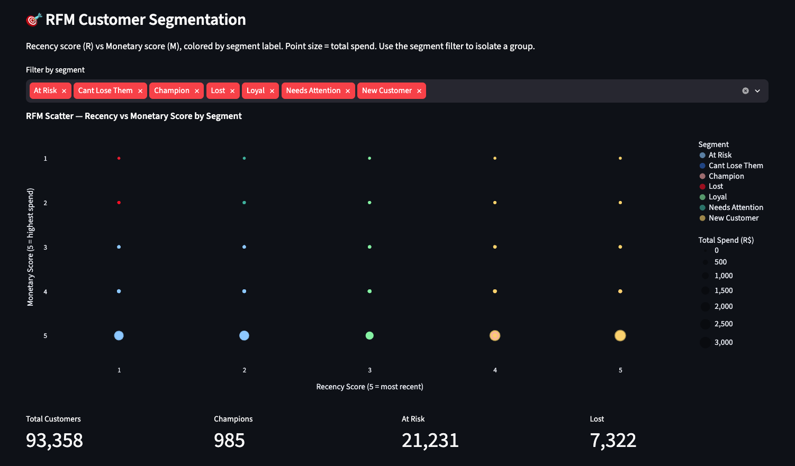

# Olist E-Commerce Analytics Platform

An end-to-end analytics engineering portfolio project built with the Brazilian Olist e-commerce dataset. The project turns raw marketplace data into tested, documented, historical, and business-ready models for analysts and decision-makers.

The primary focus is the **analytics engineering layer**: defining reliable grains, applying a three-layer dbt architecture, preserving slowly changing attributes with snapshots, testing data quality, and publishing marts that answer clear business questions.


## Why this project

This project demonstrates how I approach a realistic analytics problem rather than only writing isolated SQL queries:

- Understand the source schema and document table grain.
- Build a repeatable ingestion and quality-control pipeline.
- Transform raw data into clean, reusable analytical models.
- Preserve customer and seller history instead of overwriting it.
- Publish marts with clear business definitions and tests.
- Use the marts to produce actionable findings in a dashboard and SQL analyses.

It is designed to be relevant to **Analytics Engineer**, **Data Engineer**, and **Senior Data Analyst** interviews, with analytics engineering as the central theme.

## Business context

The Olist dataset contains Brazilian marketplace orders, covering customers, sellers, products, payments, reviews, order status, delivery dates, and geography. It contains nine source tables.

The platform answers questions such as:

- Which sellers generate revenue but create customer-experience risk?
- Which delivery corridors should operations investigate?
- How strong is customer retention after first purchase?
- Does payment-installment behavior relate to basket size?
- Which categories combine high revenue, volume, and poor reviews?

## Architecture



### Pipeline responsibilities

| Layer | Responsibility | Main technologies |
|---|---|---|
| Ingestion | Catalog raw files, convert CSV to columnar Parquet, and load the warehouse | Amazon S3, Glue Crawler, Glue ETL, Redshift Serverless |
| Quality | Validate critical source tables before warehouse loading | Great Expectations, Airflow TaskGroup |
| Transformation | Clean names and types, model business logic, and publish reusable marts | dbt Core, SQL, dbt tests |
| Serving | Expose trusted metrics to business users and analysts | Streamlit, Plotly, Redshift |
| Orchestration | Run the dependency chain and surface failures | Apache Airflow |
| Infrastructure | Define AWS resources reproducibly | Terraform |

## Analytics engineering design

### Three-layer dbt architecture

The dbt project uses a deliberately simple three-layer design:

1. **Staging** — one model per source table. Renames columns to `snake_case`, casts data types, standardizes timestamps, fixes source naming issues, and adds stable keys. Staging models are views.
2. **Intermediate** — reusable business logic such as order-level metrics, delivery calculations, customer cohorts, and payment aggregations. Intermediate models are views.
3. **Marts** — purpose-built, analyst-friendly tables with explicit grains and business metrics. Marts are tables for dashboard and query performance.

This separation keeps source cleanup, reusable logic, and stakeholder-facing metrics independent. It also means a downstream analysis can read a documented mart instead of repeating complex joins and business rules.

### Grain-first modeling

The warehouse follows a star-schema design with separate facts for different grains:

- `fact_order_items` — one row per order item
- `fact_orders` — one row per order
- `fact_payments` — one row per payment record
- `dim_customers` — customer attributes with historical validity
- `dim_sellers` — seller attributes with historical validity
- `dim_products` — product attributes
- `dim_date` — a dbt-generated date spine
- `dim_geolocation` — one row per postal-code prefix after aggregation

Keeping order, item, and payment facts separate prevents double-counting when metrics are joined. Surrogate keys generated with `dbt_utils.generate_surrogate_key()` provide stable dimensional joins.

### Snapshots and historical correctness

Customers and sellers use dbt **check-strategy snapshots**. The snapshots track changes to location attributes such as postal code, city, and state while preserving `dbt_valid_from` and `dbt_valid_to`.

This matters for delivery analysis: a seller's current location should not replace the location associated with an earlier order. Products use a Type 1 approach because historical product-attribute tracking is not required for this use case.

### Testing and documentation

The dbt project documents sources, model grains, and important columns. Tests include:

- `not_null` and `unique` tests for key fields
- `accepted_values` tests for statuses, scores, segments, and flags
- Source freshness checks in the orchestration chain
- Great Expectations validation for critical raw tables before loading
- A full dbt test step after marts and snapshots are built

The model design and rationale are documented in [docs/architecture/star_schema.md](docs/architecture/star_schema.md).

## Airflow pipeline

The `olist_daily_pipeline` DAG keeps orchestration separate from task implementation. The main dependency chain is:

```text
Glue Crawler
  → CSV-to-Parquet ETL
  → Great Expectations checks (parallel)
  → Redshift load
  → dbt source freshness
  → dbt staging
  → dbt snapshots
  → dbt intermediate
  → dbt marts
  → dbt tests
  → refreshed GX documentation
```

The quality checks run in parallel inside an Airflow `TaskGroup`, then the Redshift load waits for all checks to complete. This demonstrates fan-out/fan-in orchestration, retries, failure callbacks, and clear task dependencies.



## Dashboard and analysis outputs

The Streamlit dashboard separates responsibilities into backend queries, transformation services, chart components, and page-level orchestration. It provides seller, delivery, payment, RFM, and deeper analysis views.

### Seller performance



### Delivery delays



### Payment behavior



### RFM segmentation



## Selected findings

The findings below are based on the SQL analyses in `dbt_project/analyses/`. They are intentionally paired with caveats so that the conclusions are useful without overstating what this historical dataset can prove.

### 1. Retention is the largest commercial opportunity

Across the 2016–2018 cohorts, repeat purchase within 30, 60, and 90 days is effectively zero. The customer base is overwhelmingly one-time buyers, so growth appears to have been acquisition-led rather than retention-led.

**Recommendation:** treat retention as a major unit-economics opportunity and test post-purchase communication or loyalty incentives. A small improvement from this baseline could materially change customer lifetime value.

### 2. High-revenue sellers can still be operational risk

The seller-performance analysis identifies 447 sellers in the high-revenue/low-review “Revenue Risk” quadrant. Their average on-time delivery rate is materially lower than the “Hidden Gems” quadrant, where lower-revenue sellers show much stronger operational performance.

**Recommendation:** prioritize a seller-quality program using on-time delivery and review score as the primary controls, rather than rewarding revenue alone.

### 3. Delivery estimates are conservative

Across the 223 delivery corridors with at least 10 orders, average delivery is early relative to the estimated date. The platform-wide late rate is approximately 8–10%, but the padded estimates make average delay a weak KPI: a route can have a long actual delivery time and still appear “on time.”

**Recommendation:** use actual delivery days and late-rate together, recalibrate estimates by corridor, and investigate long-running northeast routes even when they technically beat the estimate.

### 4. Installments are associated with larger baskets

Average order value increases from approximately R$121 for single-payment orders to approximately R$419 for orders with 13+ installments. Credit card is the dominant payment method at roughly 76% of order volume.

**Recommendation:** make installment availability prominent for high-value categories. This is an association, not a causal claim; pricing, category, and customer mix should be controlled in a follow-up analysis.

### 5. Funnel completion is strong, but two transitions deserve attention

Approximately 97% of created orders reach delivered status. The largest stage-to-stage losses occur from created to approved and from shipped to delivered, but neither represents a single overwhelming bottleneck.

**Recommendation:** investigate payment approval failures and late-stage delivery exceptions before investing in a broad fulfillment redesign.

### 6. Category risk is concentrated

`computers_accessories` combines high order volume and revenue with an average review score of approximately 3. This makes it more actionable than very low-rated categories with only a handful of orders.

**Recommendation:** cross-reference category performance with the seller Revenue Risk quadrant to identify whether poor experience is concentrated among a small group of sellers.

## Technical highlights

- **SQL:** CTEs, window functions, `DATE_TRUNC`, `LAG`, `FIRST_VALUE`, `NTILE`, conditional aggregation, cohort analysis, funnel analysis, and cumulative metrics.
- **dbt:** sources, staging/intermediate/mart layers, model documentation, tests, snapshots, macros, seeds, and reusable `ref()` dependencies.
- **Data modeling:** star schema, explicit fact grains, surrogate keys, Type 2 history for customers and sellers, and a generated date dimension.
- **Data engineering:** S3 raw/processed zones, Glue catalog and ETL, Parquet conversion, Redshift loading, Great Expectations validation, and Airflow orchestration.
- **Delivery:** Streamlit dashboard with separated query, transformation, component, and page layers.
- **Infrastructure:** Docker Compose for local services and Terraform for AWS infrastructure.

## Repository structure

```text
airflow/              Airflow DAG, task factories, callbacks, and GX adapters
dbt_project/          dbt models, snapshots, tests, seeds, macros, and analyses
dashboards/            Streamlit app, Redshift queries, transforms, and charts
glue_jobs/            Glue ETL jobs for Parquet conversion and Redshift loading
great_expectations/   Expectations, checkpoints, validation runner, and docs
terraform/            AWS infrastructure definitions
docs/architecture/    OLTP and star-schema documentation
docs/screenshots/     Airflow and dashboard evidence
```

## Run locally

### Prerequisites

- Docker Desktop with Docker Compose
- AWS credentials configured through `.env` for AWS-backed services
- Redshift and S3 configuration for the full cloud path

Never commit `.env`, credentials, access keys, Terraform state, or raw data files.

### Start the local stack

```bash
docker compose build
docker compose up -d dbt gx streamlit
```

The dashboard is available at [http://localhost:8503](http://localhost:8503). To run Airflow locally for orchestration work:

```bash
docker compose up airflow-init
docker compose up -d airflow-webserver airflow-scheduler
```

Airflow is available at [http://localhost:8080](http://localhost:8080). The local development credentials are defined by the Compose setup and should be changed outside a demo environment.

### Useful dbt commands

```bash
docker compose exec dbt dbt run
docker compose exec dbt dbt test
docker compose exec dbt dbt snapshot
docker compose exec dbt dbt compile
```

## Project status and scope

This is a portfolio implementation designed to demonstrate production-minded patterns on a manageable dataset. The historical Olist data is not a live business feed, so source freshness warnings are expected for local historical runs. In a production extension, I would add automated CI checks, environment-specific deployment controls, row-level reconciliation against source systems, alert routing, and a formal metric layer.

## Data source

Dataset: [Brazilian E-Commerce Public Dataset by Olist](https://www.kaggle.com/datasets/olistbr/brazilian-ecommerce). The dataset is used for educational and portfolio purposes. Please review the source terms before redistributing the data.

## Contact

**Henry** — Data Engineering / Analytics Engineering portfolio

If you are reviewing this project for an interview, the best starting points are:

1. [dbt_project/models](dbt_project/models) for the transformation architecture.
2. [dbt_project/snapshots](dbt_project/snapshots) for historical modeling.
3. [airflow/dags/dag.py](airflow/dags/dag.py) for orchestration and dependencies.
4. [dbt_project/analyses](dbt_project/analyses) for business questions and findings.
