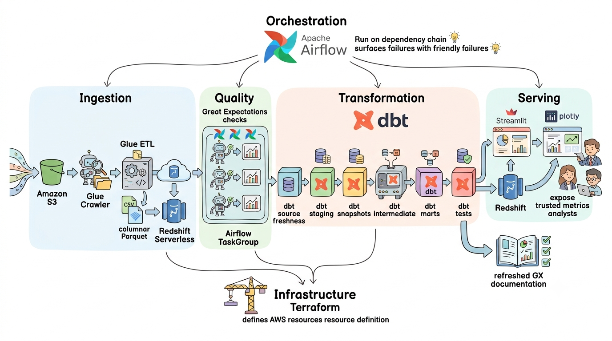

# ⚡ AWS E-Commerce Analytics Pipeline (Glue, Redshift, Airflow, dbt & Terraform)


## 📌 Project Overview
An end-to-end, production-style cloud data engineering pipeline designed to ingest, validate, transform, and model Brazilian e-commerce transaction data (Olist). Built entirely on **AWS infrastructure provisioned via Terraform**, this project demonstrates complex PySpark transformations, automated dual-stage quality gates, Airflow orchestration, and dbt dimensional modeling (Star Schema with SCD Type 2 tracking).

**Engineering Goal:** Build an automated, fully reproducible infrastructure-as-code pipeline that enforces data quality at the ingestion layer, handles schema evolution and historical tracking, and exposes business-ready marts for BI consumption.

---

## 🏗️ Architecture & Data Pipeline



1. **Infrastructure Provisioning:** Terraform provisions S3 buckets, IAM roles/policies, Glue Crawlers, and Redshift Serverless resources.
2. **Ingestion & Processing:** AWS Glue (PySpark) extracts raw relational CSV files from the S3 Raw Zone, enforces schemas, converts data to columnar Parquet format, and lands it in the Processed S3 Zone.
3. **Pre-Load Data Quality Gate:** Airflow executes a Great Expectations validation suite against the Parquet files in S3. If validation fails, the pipeline halts before touching the warehouse.
4. **Warehouse Ingestion:** Validated Parquet data is COPY-loaded into Amazon Redshift Serverless staging tables via Glue ETL.
5. **Analytics Engineering:** dbt transforms staging tables into a production Star Schema, using dbt Snapshots to manage Slowly Changing Dimensions (SCD Type 2).
6. **Serving Layer:** Modeled marts power an interactive Streamlit application for seller performance, cohort retention, and RFM segmentation analysis.

---

## ⚙️ Key Data Engineering & Infrastructure Decisions

* **Infrastructure as Code (Terraform):** Entire AWS stack (S3 storage zones, Glue catalog databases, IAM roles, and Redshift Serverless) is defined declaratively in Terraform, enabling repeatable environment provisioning and tear-downs.
* **PySpark Parquet Conversion:** Converted raw CSVs to partitioned Parquet files prior to warehouse ingestion. This optimizes S3 storage footprints and drastically accelerates downstream `COPY` command speeds into Redshift.
* **Dual-Layer Quality Enforcement (Circuit-Breaker Pattern):**
  * *Pre-Load (Great Expectations):* Asserts nullability, schema types, and value bounds on S3 Parquet files *before* staging in Redshift.
  * *Post-Load (dbt Tests):* Validates primary keys, surrogate key uniqueness, non-null constraints, and referential integrity inside Redshift.
* **SCD Type 2 Historical Tracking:** Implemented dbt Snapshots on customer and seller dimensional tables to capture attribute changes over time (e.g., location/zip code shifts) without overwriting historical transaction context.

---

## 🔄 Orchestration (Apache Airflow)

Orchestration utilizes Airflow `TaskGroup` constructs to run multi-file Great Expectations checks in parallel, converging on a single validation gate before triggering Redshift loads.


---

## 📐 Dimensional Data Model (Star Schema)

The analytical layer in Redshift is structured using a Medallion Architecture (Staging → Intermediate → Marts):


* **`fct_orders` (Fact Table):** Granular at the individual order item level. Contains measures for freight cost, item price, payment installments, and delivery lead times.
* **`dim_customers` & `dim_sellers` (Dimensions):** Maintained using `dbt snapshots` to preserve location history (`dbt_valid_from`, `dbt_valid_to`).
* **`dim_products` & `dim_payments` (Dimensions):** Converted product categories and payment type attributes with standardized translation macros.

---

## 📊 Business Delivery & Dashboard Insights

The transformed dbt marts directly feed an interactive **Streamlit** dashboard delivering actionable seller and logistics intelligence:

**Seller Quality Risk Matrix**  
Cross-referenced seller revenue with customer review scores to isolate high-volume sellers driving disproportionate refund and negative review requests.


**RFM Customer Segmentation & Logistics Bottlenecks**  
Classified customer cohorts into Recency, Frequency, and Monetary brackets. Identified specific regional freight corridors where actual delivery times exceeded estimated delivery dates by over 25%.


*(Additional insights available in the dashboard: [Delivery Delays](docs/screenshots/tab2_delivery_delays.png) & [Payment Behavior](docs/screenshots/tab4_payment_behavior.png))*

---

## 🚀 Local Development & Setup

### Prerequisites
* Docker Desktop & Docker Compose installed.
* AWS Account with configured CLI credentials (`~/.aws/credentials`).
* Terraform CLI installed.

### 1. Provision AWS Infrastructure via Terraform
```bash
cd terraform
terraform init
terraform plan
terraform apply
```

### 2. Start Local Airflow & Services
```bash
# Build local container instances
docker compose build

# Initialize and launch Airflow
docker compose up airflow-init
docker compose up -d

# Spin up Streamlit Dashboard
docker compose up -d streamlit