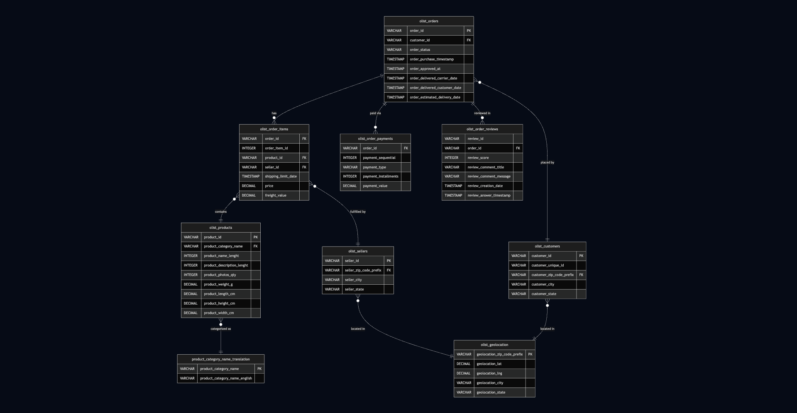
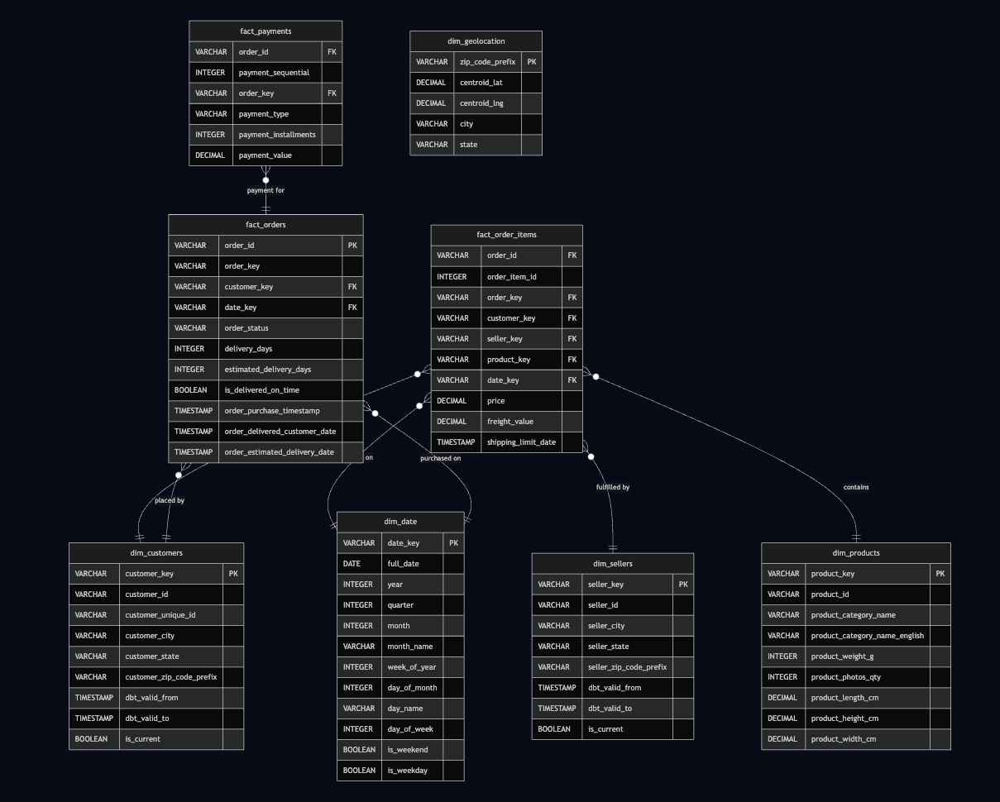

## Architecture

### Source Schema (OLTP)
The Olist dataset is a normalized Brazilian e-commerce schema with 9 tables and ~100K orders.

Full ERD with relationship annotations: [docs/architecture/oltp_schema.md](docs/architecture/oltp_schema.md)

### Target Schema (OLAP Star Schema)
The dbt transformation layer converts the OLTP tables into a star schema optimized for analytical queries and the Streamlit dashboard.

Full ERD with design rationale: [docs/architecture/star_schema.md](docs/architecture/star_schema.md)