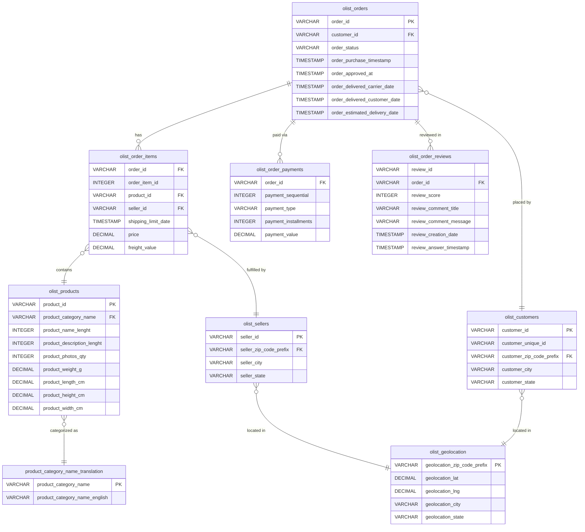

# Olist OLTP Schema — Entity Relationship Diagram

**Source:**  E-Commerce dataset 
**Location:** All tables reside in Redshift `dev_raw` schema after the Glue ETL pipeline

---

## ERD

---

## Table Summary

| Table | Rows | Role | PK | Key FKs |
|---|---|---|---|---|
| `olist_orders` | ~99K | Central transactional table | `order_id` | `customer_id` |
| `olist_customers` | ~99K | Customer dimension (with duplicate `customer_unique_id`) | `customer_id` | `customer_zip_code_prefix` |
| `olist_order_items` | ~112K | Line items — multiple rows per order | composite: `order_id` + `order_item_id` | `product_id`, `seller_id` |
| `olist_order_payments` | ~104K | Payment records — multiple per order (installments) | none (composite) | `order_id` |
| `olist_order_reviews` | ~100K | Reviews — not perfectly unique on `review_id` | `review_id` (95%+ unique) | `order_id` |
| `olist_products` | ~33K | Product catalog dimension | `product_id` | `product_category_name` |
| `olist_sellers` | ~3K | Seller dimension (smallest table) | `seller_id` | `seller_zip_code_prefix` |
| `olist_geolocation` | ~1M | Zip-to-lat/lng lookup — multiple rows per zip | `geolocation_zip_code_prefix` (not unique) | — |
| `product_category_name_translation` | ~70 | Reference/lookup — Portuguese → English category names | `product_category_name` | — |

---

## Key Observations for Star Schema Design

### Customer identity split
`olist_customers` has two IDs: `customer_id` is order-scoped and not reused across orders; `customer_unique_id` is the true repeat-customer identifier. The star schema will use `customer_unique_id` as the business key in `dim_customers`. Aggregating by `customer_id` alone would overcount unique customers.

### Non-unique review ID
`olist_order_reviews.review_id` is not perfectly unique — the Great Expectations checkpoint enforces 95%+ uniqueness rather than strict uniqueness. Treat `review_id` as a near-unique identifier, not a reliable PK. Deduplication logic belongs in the staging layer.

### Geolocation fan-out
`olist_geolocation` holds ~1M rows for ~19K zip codes — multiple lat/lng coordinate readings per zip code. The star schema will collapse this to one row per zip using centroid aggregation (avg lat/lng) or first-match, reducing the table from ~1M to ~19K rows for join performance.

### Payments fan-out
`olist_order_payments` has multiple rows per order because customers can split payment across types (credit card + voucher) and pay in installments. This will be promoted to its own fact table (`fact_payments`) in the star schema rather than flattened onto `fact_orders`, preserving the payment-level grain.

### Geolocation shared by customers and sellers
Both `olist_customers` and `olist_sellers` reference `olist_geolocation` by zip code prefix. In the star schema, a single `dim_geography` (or two separate dimension views) can service both `dim_customers` and `dim_sellers` without duplicating lat/lng data.

### Order items as the revenue grain
`olist_order_items` is the highest-cardinality transactional table (~112K rows vs ~99K orders) because a single order can contain multiple line items from different sellers. `fact_orders` will aggregate to order grain; a separate `fact_order_items` (or the items table itself at staging) preserves the line-item grain for product and seller analysis.